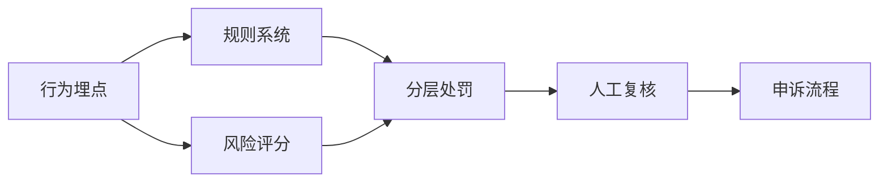

# 行为风控与治理体系

风控和反作弊有交集，但不完全相同。

风控更关注的是：`系统中有没有异常行为模式正在破坏规则、商业结果或生态秩序`。

典型场景包括：

- 工作室批量账号
- 刷号和薅活动
- 交易异常
- 资产异常流转
- 机器化行为

这类问题很多时候不是单次攻击，而是长期行为模式，因此风控更依赖：

- 行为埋点
- 规则系统
- 风险评分
- 分层处罚
- 人工复核和申诉流程

真正成熟的治理体系，不是“一刀切封禁”，而是能区分：

- 疑似异常
- 高风险异常
- 明确违规
- 需要人工介入的边界案例

处罚系统也必须和审计、客服、申诉链路打通，否则一旦误判，代价会很高。
