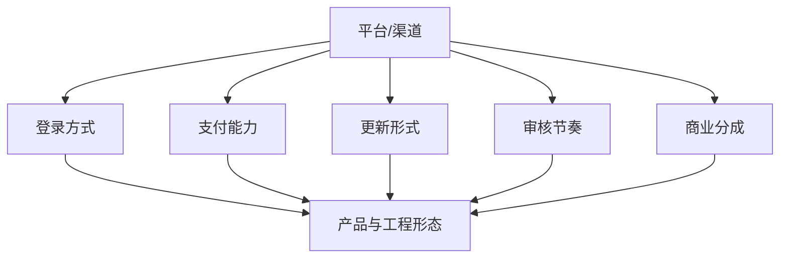
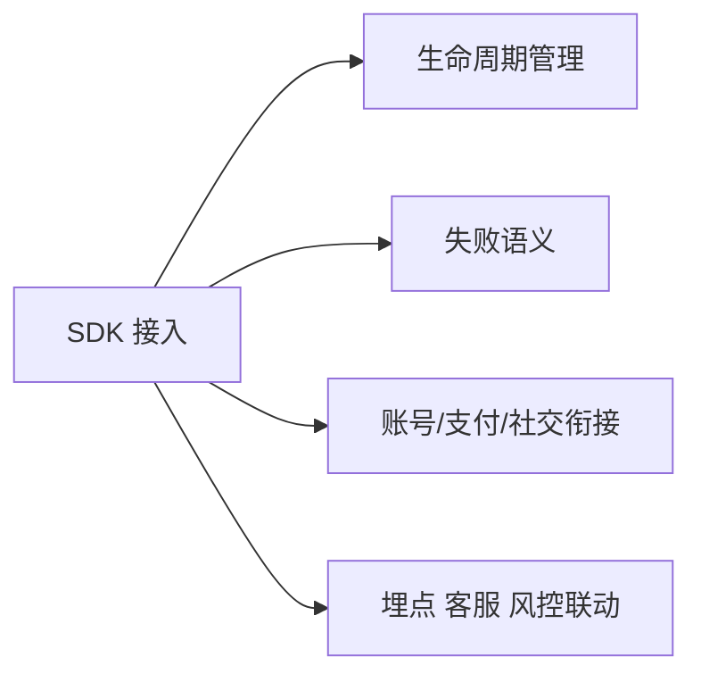

# 15. 平台生态、渠道与 SDK

这一章讨论的是：游戏并不是运行在真空里，它最终要落在平台、渠道和外部能力之上，这些外部约束会直接改变产品和工程形态。

边界约束：

- 这里主要讨论外部平台能力、渠道生态和发布约束
- 游戏内账号、支付、社交等公共业务系统统一放到第 13 章

很多团队会把平台和渠道理解成上线阶段才处理的问题，但实际上，平台能力和渠道要求往往从项目早期就开始影响客户端、版本、商业化和运营设计。

## 平台与渠道生态

不同平台和渠道，带来的不只是分发差异，而是完整的运行环境差异。

常见平台包括：

- App Store / Google Play
- 安卓渠道市场
- Steam / 主机平台
- 微信小游戏 / 抖音小游戏
- 各类区域性发行平台

它们的共同影响主要体现在：

- 登录方式
- 支付能力
- 包体和更新形式
- 审核节奏
- 商业分成
- 社交和传播能力

因此平台不是单独一层外壳，而是会反向塑造：

- 客户端组织方式
- 版本策略
- 运营能力
- 用户增长路径

## 小游戏平台与技术约束

小游戏平台是最典型的“平台直接塑造技术形态”的场景。

它们通常会附带以下约束：

- 包体限制
- 运行时环境限制
- 资源加载方式受限
- 平台 API 深度绑定
- 热更新和增量更新形式不同

这些约束会直接影响：

- 引擎和技术栈选择
- 资源拆包方式
- 首包和首帧体验
- 网络与缓存策略

很多时候，小游戏平台项目不是“把手游裁剪一下”就能做好，因为它的技术约束从一开始就不同。

## 登录、支付、社交与广告 SDK

SDK 接入的真正问题，从来不只是“API 能不能调通”，而是：

- 生命周期怎么管理
- 失败语义是什么
- 和自身账号体系怎么衔接
- 和版本、埋点、客服、风控怎么联动

### 登录 SDK

核心问题是身份绑定、渠道映射和账号体系融合。

### 支付 SDK

核心问题是支付状态、回调一致性、补单和对账。

### 社交 SDK

核心问题是分享、邀请、会话能力和平台传播链路。

### 广告 SDK

核心问题是触发时机、收益模型、平台策略和用户体验平衡。

SDK 最容易被低估的成本是长期维护成本，包括：

- 版本升级
- 平台兼容
- 审核变化
- 第三方稳定性

接入一个 SDK，从来不是“接完就结束”，而是把一个新的外部依赖引进系统。

## 发布、版本与商业模式

平台和渠道会显著影响发布节奏。

例如：

- iOS 可能受审核时效影响
- 安卓可能受渠道包分裂影响
- 主机和部分 PC 平台可能有更严格的版本规范
- 小游戏平台可能限制更新方式和代码组织

这会直接影响：

- 强更和弱更策略
- 版本兼容窗口
- 补丁包组织方式
- 运营活动排期

商业模式同样受平台生态影响。例如：

- 平台分成
- 支付通道限制
- 广告能力差异
- 社交裂变方式差异

所以平台生态不是产品发布后的附属问题，而是产品架构的一部分。
