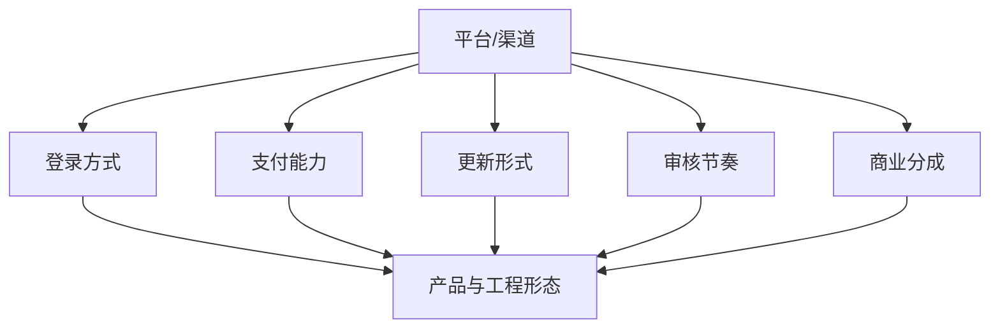

# 平台与渠道生态

不同平台和渠道，带来的不只是分发差异，而是完整的运行环境差异。

常见平台包括：

- App Store / Google Play
- 安卓渠道市场
- Steam / 主机平台
- 微信小游戏 / 抖音小游戏
- 各类区域性发行平台

它们的共同影响主要体现在：

- 登录方式
- 支付能力
- 包体和更新形式
- 审核节奏
- 商业分成
- 社交和传播能力

因此平台不是单独一层外壳，而是会反向塑造：

- 客户端组织方式
- 版本策略
- 运营能力
- 用户增长路径
