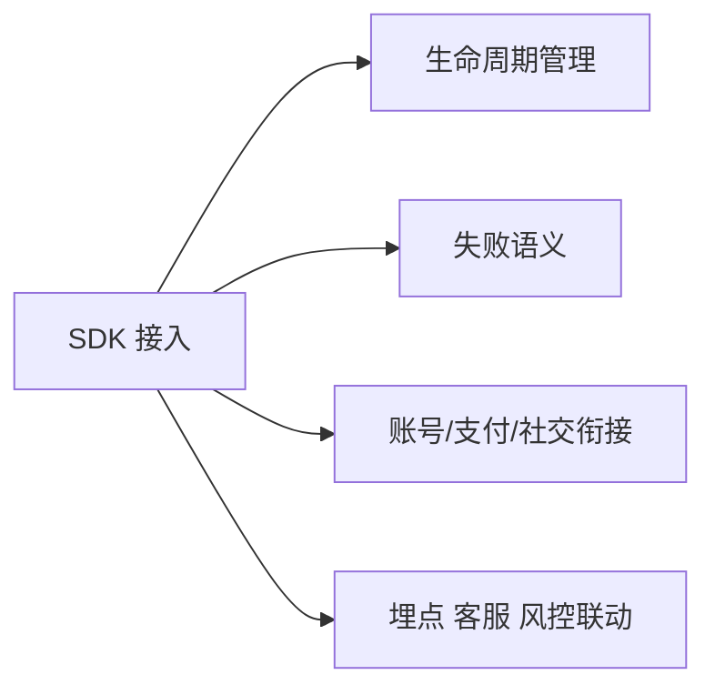

# 登录、支付、社交与广告 SDK

SDK 接入的真正问题，从来不只是“API 能不能调通”，而是：

- 生命周期怎么管理
- 失败语义是什么
- 和自身账号体系怎么衔接
- 和版本、埋点、客服、风控怎么联动

### 登录 SDK

核心问题是身份绑定、渠道映射和账号体系融合。

### 支付 SDK

核心问题是支付状态、回调一致性、补单和对账。

### 社交 SDK

核心问题是分享、邀请、会话能力和平台传播链路。

### 广告 SDK

核心问题是触发时机、收益模型、平台策略和用户体验平衡。

SDK 最容易被低估的成本是长期维护成本，包括：

- 版本升级
- 平台兼容
- 审核变化
- 第三方稳定性

接入一个 SDK，从来不是“接完就结束”，而是把一个新的外部依赖引进系统。
